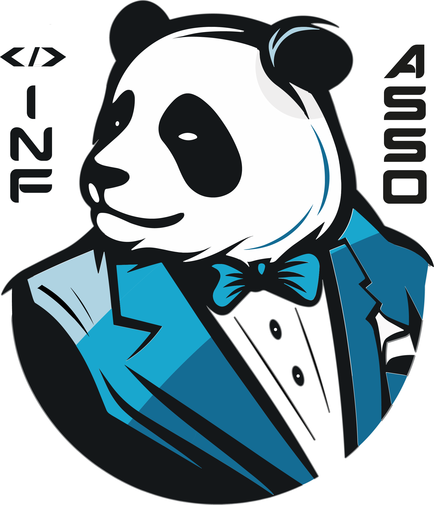
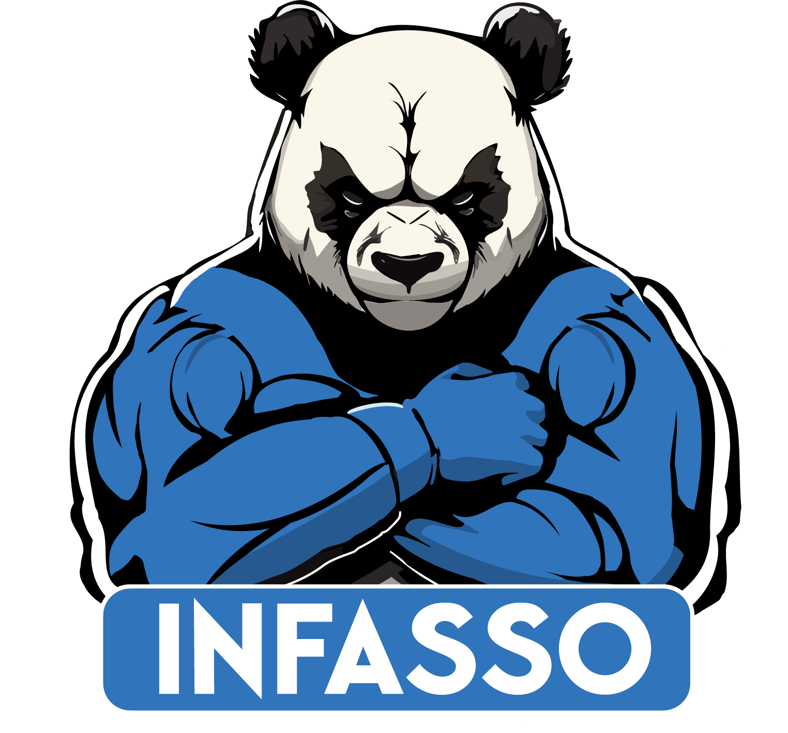
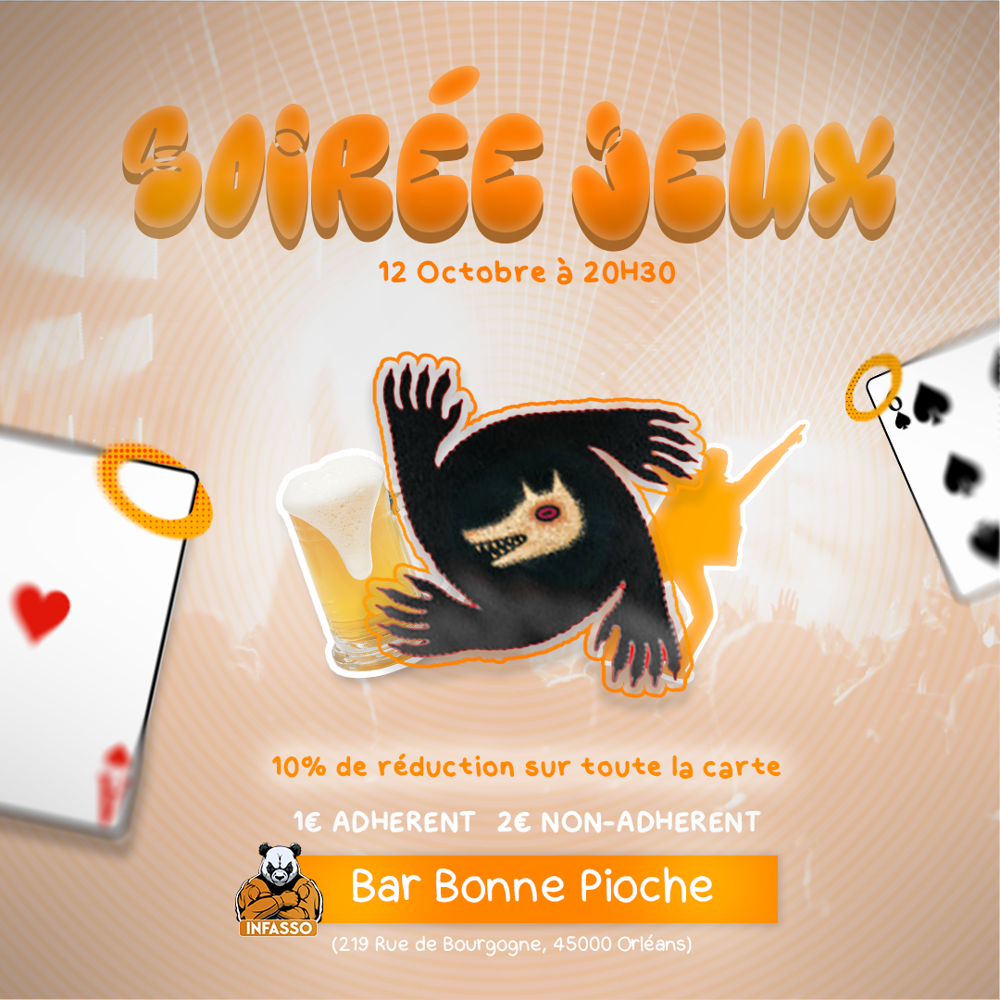

# Réalisations avec la suite Adobe

## Logos

> Illustrator 2023, Photoshop CC 2023

### Logos pour l'infasso :

Proposition retenu (logo actuelle de l'infasso) : 

### Logo pour une marque de vêtement "Et Moi?"

À venir

## Affiche

## Vidéos

>Adobe After Effects 2022

(qualité compressée pour git)

Entraînement au mo-graph sur le thème de Chainsaw Man.

https://www.youtube.com/shorts/xOS6g6sqtVI

Hommage à un personnage du film "MADE IN ABYSS : L'AURORE DE L'ÂME DES PROFONDEURS"

https://www.youtube.com/shorts/homXl7rVVDI

